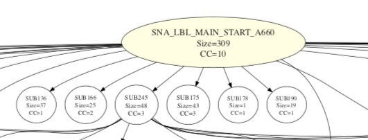
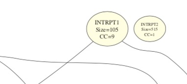
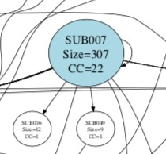
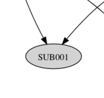

# z80dismblr

z80dismblr is a Z80 command line disassembler written in typescript.

It is available now in version 1.0.0.
I.e. it is complete and working in general but there might be some faults still.
Please don't hesitate to report any problem that you find.

## Features

- Disassembles the given binary via Code-Flow-Grap analysis.
- Divides into data and code area.
- Creates labels from hex addresses.
- Distinguishes labels for subroutines or jump addresses.
- Separates subroutines visually.
- Uses "local" label syntax inside subroutines.
- Points out all callers of a subroutine.
- Customization of the output
	- Label prefixes
	- list file with or without address and opcode bytes
	- Opcodes in upper or lower case
- Can read binary files.
- Supports *.sna (snapshot) files.
- Can read MAME trace (*.tr) files for better results.
- Supports undocumented opcodes.
- Supports Spectrum Next opcodes.

## Installation

<!--
You can either install the npm z80dismblr package or use the provided executables directly.

npm install:
~~~
$ npm install z80dismblr
~~~

If you want to use the executable instead you find executables for Windows, Mac and Linux [here](https://github.com/maziac/z80dismblr/releases). Simply download and execute from the command line.
-->

At the moment there is no npm install package available but you can install the executable directly.
Executables exist for Windows, Mac and Linux.
Just download [here](https://github.com/maziac/z80dismblr/releases), unzip and execute from the command line.

## Usage

Simply execute the unzipped file from the shell.

_Note: Usage is shown here for MacOS only, it should work similar for Linux and Windows._

To create an assembler listing for the snapshot file 'myfile.sna' just use:
~~~
$ ./z80dismblr-macos --sna myfile.sna --out myfile.list
~~~~

It reads in the file (which is in SNA file format) and writes it to stdout which is redirected into the 'myfile.list' file.

The disassembly looks like this:
~~~
; Subroutine is referenced by 3 locations:
; 0x8e67(in SUB156), 0x8e3e(in LBL088), 0x8e87(in LBL089)
8E73 SUB157:
8E73 79           LD   A,C
8E74 0F           RRCA
8E75 0F           RRCA
8E76 0F           RRCA
8E77 0F           RRCA
8E78 0F           RRCA
8E79 E6 07        AND  7      ; 07h
8E7B 6F           LD   L,A
8E7C 78           LD   A,B
8E7D 0F           RRCA
8E7E 0F           RRCA
8E7F E6 38        AND  56     ; 38h, '8'
8E81 B5           OR   L
8E82 C9           RET

; Label is referenced by 1 location:
; 0x7537(in LBL013)
8E83 LBL089:
8E83 ED 4B C4 95  LD   BC,(DATA166) ; 95C4h
8E87 CD 73 8E     CALL SUB157 ; 8E73h
8E8A 26 8D        LD   H,141  ; 8Dh, -115
8E8C 0E 08        LD   C,8    ; 08h
8E8E 91           SUB  A,C
8E8F 6F           LD   L,A
8E90 2D           DEC  L
8E91 CB 46        BIT  0,(HL)
8E93 20 1A        JR   NZ,.lbl089_loop2 ; 8EAFh
8E95 2C           INC  L
~~~

A SNA file contains an entry point into the code. So it is not necessary to provide a'--codelabel'.
However, the entry point in the SNA file might not be very good for disassembly purposes in that case
prepare more information via '--codelabel'.

You can also read in binary files (without headers), e.g. MAME roms.
For binary files you have to provide additional info of the offset address
of the loaded file.
~~~
$ ./z80dismblr-macos --bin 0 rom1.bin --bin 0x1000 rom2.bin --bin 0x2000 rom3.bin --codelabel 0x800 MAIN_START --out roms.list
~~~~
This will load 3 binary files (rom1.bin, rom2.bin and rom3.bin).
rom1.bin starts at address 0, rom2.bin at address 0x1000 and rom3.bin at address 0x2000.
There are 2 initial labels where code starts: at 0x800 the main program starts. Address 0 is added automatically as program start.

If you know nothing about the code the better way will be to provide a MAME trace file. I.e. you run MAME with the debugger and the trace option
and save it to a file, e.g. myfile.tr.
Now you start a disassembly and provide the file:
~~~
$ ./z80dismblr-macos --bin 0 rom1.bin --bin 0x1000 rom2.bin --bin 0x2000 rom3.bin --tr myfile.tr --out roms.list
~~~
Note that you can but you don't have to provide a --codelable in this case.

You can higly customize the appearance of the output, e.g. you can specify if the address is shown in front of each line or if the opcode bytes are shown.

~~~
; Subroutine is referenced by 1 location:
; 0xe1f1(in SUB305)
SUB156:
             bit  0,e
             jr   z,.sub156_l ; 8E67h
             ld   hl,36353 ; 8E01h, -29183
             ld   (hl),c
             inc  hl
             ld   (hl),b
.sub156_l:
             call sub157 ; 8E73h
             ld   h,141  ; 8Dh, -115
             ld   l,a
.sub156_loop:
             ld   (hl),e
             inc  hl
             dec  d
             jr   nz,.sub156_loop ; 8E6Dh
             ret
~~~

Please use
~~~
$ ./z80dismblr-macos -h
~~~
to print a help for all allowed arguments.

### Arguments File

Instead of a big argument list you can also pass all arguments via a file.
The format is exactly the same as on the commandline.
To disassemble the rom file from above you would need a file with
the following contents:
~~~
$ cat argsfile
--bin 0 rom1.bin
--bin 0x1000 rom2.bin
--bin 0x2000 rom3.bin
--tr myfile.tr
~~~

~~~
$ ./z80dismblr-macos --args argsfile --out roms.list
~~~

## Caller Graphs

With the '--dot' option it is possible to let z80dismblr create .dot files for use with [Graphviz](http://www.graphviz.org).

An example for the program "Star Warrior" (48K ZX Spectrum program) is shown here:

Although this looks very confusing on first sight a few things can be learned from this view:

- We get an overview of all sub routines and how there are interconnected. Each arrow means sub routine "SUBn" calls sub routine "SUBm".
- We can see the leafs, i.e. the subroutines that do not call other sub routines. Often these are very generic functions like math calculations etc. When doingreverse engineering it is often helpful to start with those functions and work from bottom to top to understand the
higher layer sub routines.
- We can see one or more roots, e.g. the main routine. We can also try top-down to understand the called sub routines.
- Calls into unassigned memory (i.e. addresses outside of the given binary) are shown in gray.

The highlighted roots:

This example shows 4 roots. Why is this?
1. SNA_LBL_MAIN_START_A660 is the address from the SNA file. Since no other code parts references (jumps to) it, it is a root. Here truly the program starts.
2. INTRPT1 is the interrupt that is called 50 times per second on the Spectrum.
Normally z80dismblr cannot find interrupts because it uses a CFG anaylsis and if no location refers to the interrupt z80dismblr cannot see it. So you would have to manually set the interrupt address via an argument to z80dimblr ("--codelabel address"). In this case however the "-tr" option was used and so z80dismblr could additionally analyse the traces and find the interrupt by itself.
3. INTRPT2: This in fact is the real interrupt location. Here a simple "JP INTERPT1" could be found. The reason why z80dismblr did not draw any lines from here is: it is self-modifying code. The binary that z80dismblr anaylsed simply contains 3 "NOP" operations. Thus there is no label. The jump operation and the jump location is written by executing the code. But since z80dismblr doesn't do a dynamic analysis it cannot see the these values.
4. SUB007: This looks strange. And indeed, this helped me to find an error in the assembler program. It was hard to find but in the end the code boiled down to the very simple:
~~~
711D:
        ...
        CALL NZ,711D
        ...
~~~
I.e. a recursive call to itself which was wrong coding simply. It was not intended to write a recursive function.
However z80dismblr thinks LABEL is a subroutine because it is called via a CALL so it assigns the 711D as a label ("SUB007"). But no other location refers to 711D so that the address has no caller, i.e. no arrow pointing to it.
z80dismblr will spit out a warning now in cases like the one above:
~~~
$ Warning: Address: 711Dh. A subroutine was found that calls itself recursively but is not called from any other location.
z80dismblr.ts:39
~~~

---

A leaf:

A call to unassigned memory result in a gray bubble (in case of SNA files for the ZX Spectrum this would be calls into the ROM area):

## Interactive Usage

\<Not yet. Probably next version.\>

## Statistics

Apart from the disassembly output with the labels and the mnemonics z80dismblr also prints out a few statistics in the comments.
For each sub routines it lists the callers and callees.
Additional the size of the sub routine is shown in bytes and the cyclomatic complexity (CC).

## Recommendations

If you know nothing about the binary that you disassemble the output of the z80dismblr might be disappointing.
According to the way how it executes the disassembly (see [How it works](#how-it-works)) it can easily happen that not all code paths are found.

Thus the more you know about the code and the more '--codelabel' entries you can pass as arguments the better.

If you still don't know nothing about the binary then you should get a trace file e.g. from MAME. This trace file is obtained from the MAME debugger while executing the binary.
It's format is a simple disassembly with the first number being the hex address (in ASCII) followed by the disassembly of the executed code.
z80dismblr does only look for the hex address and assumes all of these addresses to be CODE area that need to be disassembled.

Please note that using a trace file can result in surprising issues in case of self modifying code.
As z80dismblr doesn't know about dynamic changes you might find code areas with senseless opcodes (or NOPs). This is because the code is written during runtime. For code based on ROMs this shouldn't happen, but for code that resides in RAM (e.g. ZX Spectrum programs) this can be an issue.

## How it works

The z80dismblr uses a [Control-Flow-Graph](https://en.wikipedia.org/wiki/Control_flow_graph) (CFG) to analyse the binary file(s).
I.e. it runs through the code through all possible paths and disassembles it.

Consider the following example:

~~~
0008h 87           ADD  A,A
0009h 30 05        JR   NC,0010h
000Bh 24           INC  H
000Ch C3 10 00     JP   0010h

000Fh FF           ??

0010h 85           ADD  A,L
0011h 6F           LD   L,A
0012h D0           RET  NC
0013h 24           INC  H
0014h 3A 18 00     LD   A,(0018h)
0017h C9           RET

0018h FF           ??
~~~~

If z80dismblr is told to start at address 0008h it steps through the code until a branch (JR, JR cc, JP, JP cc, CALL or Call cc) is found.
It then uses the new address as another start point to opcodes.
Depending on the branch instruction it continues to disassemble at the following address or stops (e.g. JP unconditional).

For the code above this leads to the following CFG:
~~~
 ┌──────────────┐
 │ 08h: ADD A,A │      Start
 └──────────────┘
         │
         ▼
 ┌──────────────┐
 │09h: JR NC,10h│───────────┐
 └──────────────┘           │
         │                  ▼
         │          ┌──────────────┐
         │          │  0Bh: INC H  │
         │          └──────────────┘
         │                  │
         │                  ▼
         │          ┌──────────────┐
         │          │ 0Ch: JP 10h  │
         │          └──────────────┘
         │                  │
         ▼                  │
 ┌──────────────┐           │
 │ 10h: ADD A,L │◀──────────┘
 └──────────────┘
         │
         ▼
 ┌──────────────┐
 │ 11h: LD L,A  │
 └──────────────┘
         │
         ▼
 ┌──────────────┐    As the return address is unknown
 │ 12h: RET NC  │    to the disassembler this opcode
 └──────────────┘    doesn't imply branching.
         │
         ▼
 ┌──────────────┐
 │  13h: INC H  │
 └──────────────┘
         │
         ▼
┌─────────────────┐
│14h: LD A,(0018h)│
└─────────────────┘
         │
         ▼
 ┌──────────────┐
 │   17h: RET   │      Stop
 └──────────────┘
~~~

We can see already a few important points:
- The data at addresses 000Fh is not disassembled as this data is not reachable.
- The disassembly will stop if all branch addresses have been analysed.

Additionally to the CFG analysis there is also a code and data label analysis.
This is why address 0018h can be interpreted.
The disassembler interpretes all opcodes that deal with data addresses like in 'LD A,(0018h)'.
This adddresses are known to contain data and so the disassembler disassembles the bytes
to a 'DEFB' and assigns a label to it.

Here is the resulting disassembly:
~~~
0008 RST08:
0008 87           ADD  A,A
0009 30 05        JR   NC,RST16 ; 0010h
000B 24           INC  H
000C C3 10 00     JP   RST16  ; 0010h

000F FF           DEFB 255    ; FFh,   -1

0010 RST16:
0010 85           ADD  A,L
0011 6F           LD   L,A
0012 D0           RET  NC
0013 24           INC  H
0014 3A 18 00     LD   A,(LBL_DATA1)
0017 C9           RET

0018 LBL_DATA1:
0018 FF           DEFB 255    ; FFh,   -1
~~~

### Flow-through

Consider the following code:
~~~
SUB1:
             LD   B,34
             LD   D,1

SUB2:
             LD   A,33
             RET

START:
             CALL SUB1
             CALL SUB2
             RET
~~~
There are 2 sub routines SUB1 and SUB2. SUB1 flows-through into SUB2.
So for the disassembler it is not clear to which subroutine the bytes "LD A,33" belong.
This is solved by the following idea:
The code above is logically the same as this:
~~~
SUB1:
             LD   B,34
             LD   D,1
             CALL SUB2    <- Instead of flow-through
             RET          <- Instead of flow-through

SUB2:
             LD   A,33
             RET

START:
             CALL SUB1
             CALL SUB2
             RET
~~~
I.e. z80dismblr wil only treat "LD B,34" and "LD D,1" as belonging to SUB1.
"LD A,33" and the following "RET" belong to SUB2.
Additionally it adds a reference from SUB1 to SUB2 because SUB1 flows-through/calls
SUB2. The references can be found in the comments output of the disassembler.
The result is shown here:
~~~
; Subroutine: Size=4, CC=1.
; Called by: START[8007h].
; Calls: SUB2.
SUB1:
             LD   A,34   ; 22h, '"'
             LD   A,1    ; 01h

; Subroutine: Size=3, CC=1.
; Called by: START[800Ah], SUB1[8002h].
; Calls: -
SUB2:
             LD   A,33   ; 21h, '!'
             RET

; Subroutine: Size=7, CC=1.
; Called by: -
; Calls: SUB1, SUB2.
START:
             CALL SUB1   ; 8000h
             CALL SUB2   ; 8004h
             RET
~~~

